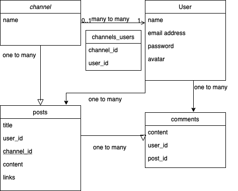

# GADDIT 

Gaddit is a forum web application that will let you follow channels you are interested in, read the latest posts and write your posts or comments. 

## Technology included

- Ruby 2.7.5
- Ruby on Rails  5.2.7
- [Faker](https://github.com/faker-ruby/faker) for fake data generation
- PostgresSQL
- [MaterializeCSS](https://materializecss.com/media-css.html) for frontend design
- [Cloudinary](https://cloudinary.com) for image upload and presentation
- [Heroku](http://heroku.com) for deployment

## Try it out

- [Try Gaddit here](https://gaddit.herokuapp.com)
- You could skip creating an account by using the logins below: 
  - Email: `abby.hansen@stoltenberg.name`
  - Password: `chicken`

## Scope

## Features

- You could sign up via the "sign up" button in the navigator bar and login.
- If you checked the "remember me" box, your login status would last two weeks, except log out.
- Once you log in successfully, all the latest posts under the followed channels will be displayed on the user's homepage in DESC order.
- Click "read more" to check the post's content and comments underneath.
- You could leave comments on any post page you are interested in, whether under the followed channel or not. 
- On each post page, you could create or delete your comment below the post. 
- Click the channel name at the bottom of each post will head to the channel page.
- Click "All channels" in the navigator to index all the channels. You could choose to join or leave the channels.
- All the posts should be created under one of the followed channels.

## Planning

- Created a scope flowchart showing all four main models: user, channel, post and comment
- Draw out the model associations to clear the whole structure
- List all the potential routes and features on each page.

## Things learnt 

- Plan the scope and features to build and follow the daily schedule
- Create many-many and one-many associations correctly.
- Use partials to DRY up the post and comments views and make them readable.
- Test every function and use the rails console to find any conflicts or bugs.
- Read the Heroku log to figure out any errors that need to fix.
- Challenging part: 
  - Using strong params and hidden data in forms to pass the data I need to the next page.
  - CSS styling and integrating materialcss into the picture.
- Future TODOs:
  - Reset passwords
  - Reply comments 
  - Create new channels

## ScreenShot

